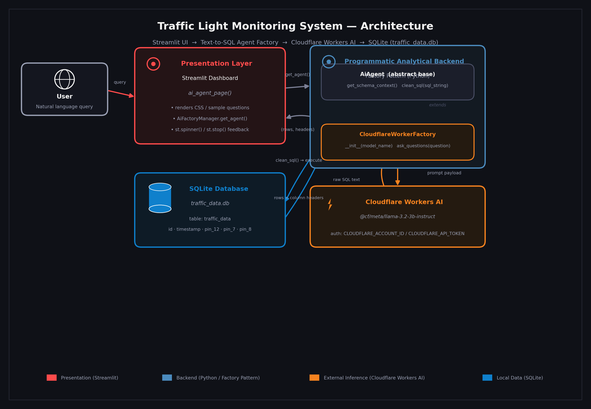

= Architecture Document: 
:systembase: {system-name}
:author: {Raziq Din}
:revnumber: 1.0
:revdate: {docdate}
:toc: left
:toclevels: 3
:sectnums:

:system-name: System Name
:author-name: Author Name

== Introduction

- This document provides an overview of the architecture of the Traffic Light Monitoring System. It describes the system's components, their interactions, and the design decisions made during development.

=== Purpose

- The purpose of this document is to provide a comprehensive understanding of the architecture of the Traffic Light Monitoring System. It serves as a reference for developers, stakeholders, and maintainers to understand the system's structure, design decisions, and operational considerations.

=== Scope

- The scope of this document includes the architectural views, key technical decisions, data architecture, security architecture, observability, operational concerns, and any open questions or risks associated with the Traffic Light Monitoring System. It does not cover detailed implementation specifics or user interface design.

=== Architecture Diagram
- Below is a high level architecture diagram of the Traffic Light Monitoring System, illustrating the main components and their interactions.

==== Explanation of Components

- **Streamlit Dashboard:** The user interface layer that allows users to interact with the system using natural language queries. It captures user inputs, manages state, and displays query results and execution feedback.

- **Text-to-SQL Data Pipeline:** The backend component that processes natural language queries, translates them into SQL queries, and executes them against the embedded SQLite database. It handles prompt orchestration, parsing, and inference interactions.

- **SQLite Database:** The local database that stores traffic light state data, including timestamps and pin states for red, yellow, and green lights. It serves as the data source for the system's analytical routines.

- *Programmatic Analytical Backend (Factory Pattern):* The backend architecture that manages the orchestration of AI agents, schema context, and SQL query execution. It ensures a decoupled design between the presentation layer and the analytical backend.

- *CloudFlare Worker AI: (Concrete Product)* The AI inference layer that processes natural language queries and generates SQL queries. It interacts with the SQLite database to retrieve relevant data based on user inputs.

- *Ollama LLM: (Concrete Product)* The large language model used for natural language understanding and SQL query generation. It is integrated into the system to provide intelligent query processing capabilities.

==== Summary

- The Traffic Light Monitoring System architecture is designed to provide a seamless user experience for monitoring traffic light states using natural language queries. The decoupled design allows for flexibility in the presentation layer and analytical backend, enabling efficient query processing and data retrieval. The system leverages AI inference and large language models to enhance its capabilities, ensuring accurate and relevant responses to user queries.

